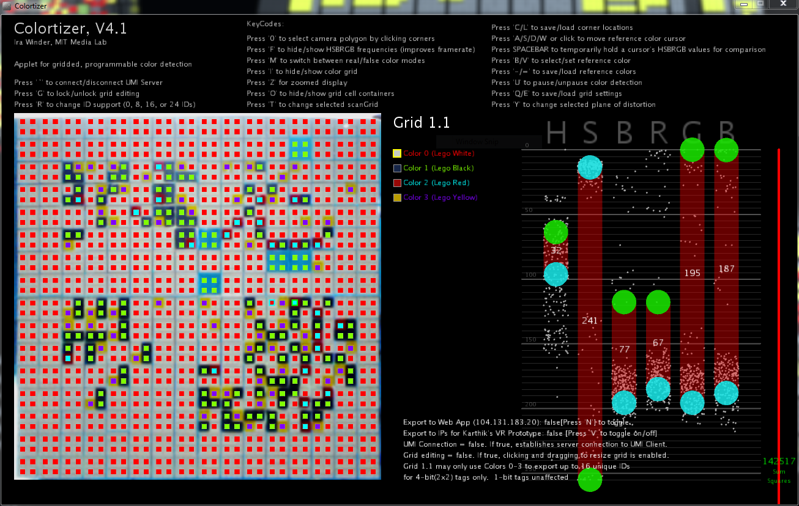
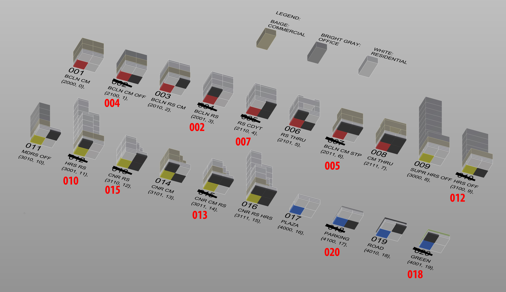

# Colortizer Repository
Solely Developed by Ira Winder [jiw@mit.edu] MIT Media Lab

(Note: Ownership of this repository was transferred from the discontinued "Changing Places" Repository on August 7, 2017.)

Colortizer is open source software that translates a grid of color-tagged objects into a matrix of IDs and their rotation to serve projects like the open-source "CityScope" platform:
[http://cp.media.mit.edu/city-simulation](http://cp.media.mit.edu/city-simulation), 
[Youtube: Lego Scanning Technology Invented by MIT] (https://youtu.be/3jvmoj7pLZU)
* Arrange a Meeting with Ira before making any commits to this repository.
* Avoid forking the repository and instead opt to make a new branch.
* Colortizer is pretty scalable and flexible in its back-end but you might not see this from looking at the front-end.  Expanding the grid capactiy wouldn't be terribly hard as long as you're willing to poke around the back-end.

## Setup
1. Clone Repository to your machine
2. Download Processing 2.2.1 from [Processing.org](https://processing.org/download/?processing) and set its preferences such that the Sketchbook location is the *Colortizer/Processing/* Folder. ( We use Processing 2 since Colortizer uses some libraries which have not yet migrated to Processing 3 )
3. Re-start Processing 2.  Now all of the sketches should show up under File>Sketchbook>

## Useful Tips
* **Colortizer** takes a webcam input of colored tags and turns it into a matrix of IDs & rotations passed via UDP
* **DO NOT** edit the *Processing/libraries/* folder needed to run Processing:

## Development Notes
Colortizer scripts are compiled and tested with Processing IDE 2.2.1 on Windows7 and OSX on a Logitech C920 Webcam.
As of January 12, 2016, the following Processing libraries are required.  These should be kept up to date in the repository’s *Colortizer/Processing/libraries/* folder:
* **OpenCV** by Greg Borenstein
* **UDP** by Stephane Cousot

## Screen Shots
* Define and un-distort rectilinear area to scan
 
* Fine-tune grid alignment and color callibration
 
* Example of 16 Tag Patterns Read by Colortizer
 
