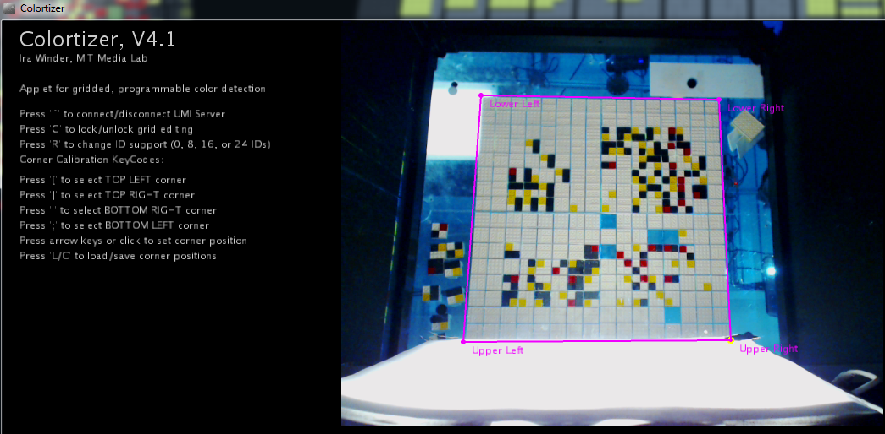

# Colortizer Repository
By Ira Winder [jiw@mit.edu] MIT Media Lab
Copyright March, 2014

Colortizer software translates a grid of color-tagged objects into a matrix of IDs and their rotation, largely to serve the "CityScope" platform at  [http://cp.media.mit.edu/city-simulation](http://cp.media.mit.edu/city-simulation). 
* Arrange a Meeting with Ira Winder [jiw@mit.edu] before making any commits to this repository.
* Avoid forking the repository and instead opt to make a new branch.

## Setup
1. Clone Repository to your machine
2. Download Processing 2.2.1 from [Processing.org](https://processing.org/download/?processing) and set its preferences such that the Sketchbook location is the *Colortizer/Processing/* Folder. ( We use Processing 2 since Colortizer uses some libraries which have not yet migrated to Processing 3 )
3. Re-start Processing 2.  Now all of the sketches should show up under File>Sketchbook>

## Useful Tips
* **Colortizer** takes a webcam input of colored tags and turns it into a matrix of IDs & rotations passed via UDP
* **DO NOT** edit the *CityScope/libraries/* folder needed to run Processing:

## Screen Shots
* Define and un-distort rectilinear area to scan
 
* Fine-tune grid alignment and color callibration
 

## Development Notes
Colortizer scripts are compiled and tested with Processing IDE 2.2.1 on Windows7 and OSX on a Logitech C920 Webcam.
As of January 12, 2016, the following Processing libraries are required.  These should be kept up to date in the repository’s *CityScope/Processing/libraries/* folder:
* **OpenCV** by Greg Borenstein
* **UDP** by Stephane Cousot
